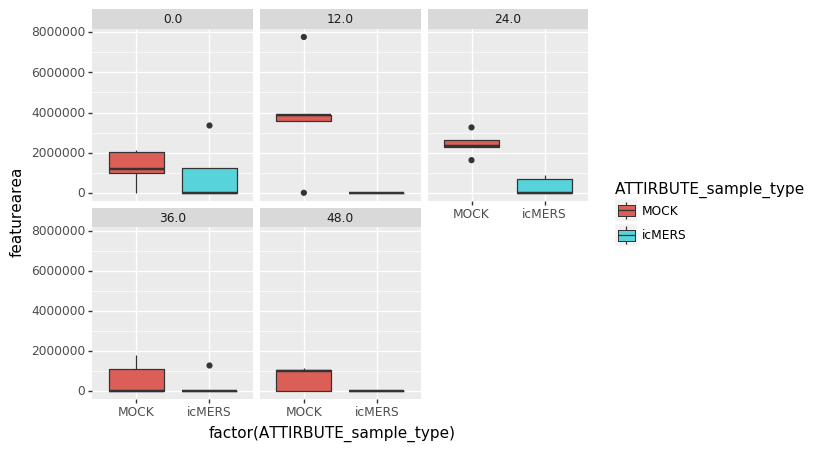
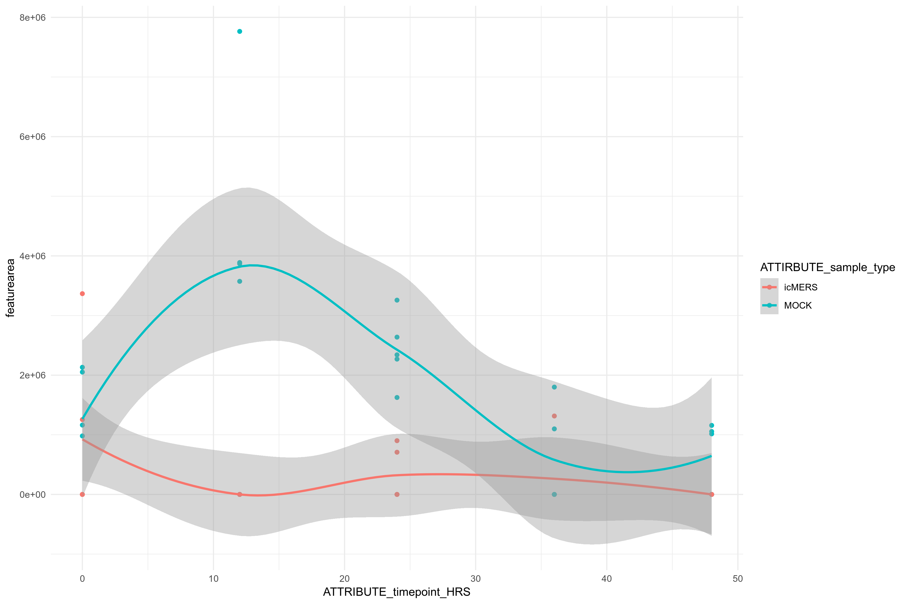

# Metabolomics Data

Please let us know (miw023@ucsd.edu and ajarmusch@ucsd.edu) if you have any datasets for SARS-CoV2) data. We are currently analyzing MERS data below. 

## MERS Lipidomics Data

There are many datasets from the following publications

[MPLEx: a Robust and Universal Protocol for Single-Sample Integrative Proteomic, Metabolomic, and Lipidomic Analyses](https://msystems.asm.org/content/1/3/e00043-16)

The raw lipidomics data as a start can be found in MassIVE:

1. [Primary human airway epithelial cells lipidome response to an icMERS coronavirus MHAE003 - MSV000083535](https://massive.ucsd.edu/ProteoSAFe/dataset.jsp?task=e29c0f5896d0409b952ccdd1cc65902d)
1. [Primary human airway epithelial cells lipidome response to an icMERS coronavirus - MSV000083534](https://massive.ucsd.edu/ProteoSAFe/dataset.jsp?task=459d2c8abfe340159ce106bad13998c3)
1. [Primary human airway epithelial cells lipidome response to an icMERS coronavirus - MSV000083533](https://massive.ucsd.edu/ProteoSAFe/dataset.jsp?task=e3260819d6be421e8c7e532571c8b322)

These data from [Thomas O. Metz's Lab](https://www.pnnl.gov/science/staff/staff_info.asp?staff_num=5876) from PNNL are time course studies of the lipidome of the airway epitheleal tissue. 

We have compiled the metadata from the data (here)[data/MSV000083535_metadata_combined.tsv].

### Initial Metabolomics Analysis 

Qualitative Analysis 


| Dataset | Analysis |
|-------------|------|
| MSV000083535 |  [Spectral Library Search](https://gnps.ucsd.edu/ProteoSAFe/status.jsp?task=425aef553b2a4ea7806396b61ada7a2f) |
| MSV000083535 |  [Classical Molecular Networking](https://gnps.ucsd.edu/ProteoSAFe/status.jsp?task=bf38981e2a644febaf0ff7120d0f5ec2)    | 
| MSV000083535 - Positive |  [Qemistree](https://proteomics2.ucsd.edu/ProteoSAFe/status.jsp?task=ec3a206df3714d469587b97c7dc5d278) |


Relative Quantitative Analysis

| Dataset | Feature Detection | FBMN | Data API | Esquisse |
|-------------|------|-----------|----------|-----|
| MSV000083535 - Positive Data |  [Analysis](https://proteomics3.ucsd.edu/ProteoSAFe/status.jsp?task=91d37d9207d244fda93fd33d8b9417a0)    |   [Analysis](https://proteomics3.ucsd.edu/ProteoSAFe/status.jsp?task=ea52b0d79c0c4b55a31c2a6454fb9fb5) | [API](https://proteomics3.ucsd.edu/ProteoSAFe/DownloadResultFile?task=ea52b0d79c0c4b55a31c2a6454fb9fb5&file=feature_statistics/data_long.csv) | [Link](http://dorresteintesthub.ucsd.edu:8347/?task=ea52b0d79c0c4b55a31c2a6454fb9fb5) |
| MSV000083535 - Negative Data |  [Analysis](https://proteomics3.ucsd.edu/ProteoSAFe/status.jsp?task=9c46288f9c754bd5931fed17414db7b4)    |   [Analysis](https://proteomics3.ucsd.edu/ProteoSAFe/status.jsp?task=3ed2ee9297ed47f09b42825370895ee9) | [API](https://proteomics3.ucsd.edu/ProteoSAFe/DownloadResultFile?task=3ed2ee9297ed47f09b42825370895ee9&file=feature_statistics/data_long.csv) | [Link](http://dorresteintesthub.ucsd.edu:8347/?task=3ed2ee9297ed47f09b42825370895ee9) |


This API data is a tall tabular csv file with feature and sample metadata pulled into it. It is readily plotable in tools like ggplot2 (R) and plotnine (python). You can read it into your software in a single line:

```
pd.read_csv("https://proteomics3.ucsd.edu/ProteoSAFe/DownloadResultFile?task=3ed2ee9297ed47f09b42825370895ee9&file=feature_statistics/data_long.csv")
```

### Preliminary Results

Positive Ionization Results - [sorted by p-value between mock and MERS](https://proteomics3.ucsd.edu/ProteoSAFe/result.jsp?task=ea52b0d79c0c4b55a31c2a6454fb9fb5&view=network_stats_selected_columns)

Example Feature 8378 across different time points of infection:




Molecular Network - highlighting significant features in MOCK (purple) vs iMERS


Download entire network [here](data/MSV000083535-pos.cys)

### Data Processing Methods

We aim to imploy the following analysis pipeline:

1. Feature Finding with MZmine2 in GNPS - Produces peak integration from data
1. Feature Based Molecular Networking in GNPS - Produces Molecular network and spectral library matches - machine readable quantitative data
1. Statistical Analysis and exploration via Jupyter Notebooks


## MERS GC Data

There are many datasets from the following publications

[MPLEx: a Robust and Universal Protocol for Single-Sample Integrative Proteomic, Metabolomic, and Lipidomic Analyses](https://msystems.asm.org/content/1/3/e00043-16)

The raw GC Metabolomics data as a start can be found in MassIVE - Primary human airway epithelial cells metabolome response to an icMERS coronavirus

1. [MSV000081891](https://massive.ucsd.edu/ProteoSAFe/dataset.jsp?task=6d0cbbef55524bdcb117bad2bb47f09c)
1. [MSV000081890](https://massive.ucsd.edu/ProteoSAFe/dataset.jsp?task=a267ff6313df4110a627b9f5d8ceb4a2)
1. [MSV000081889](https://massive.ucsd.edu/ProteoSAFe/dataset.jsp?task=acdc3f285856415f9d94711bd3a769d2)

We have compiled the metadata from the data (here)[data/MSV000081889_81890_81891_metadata_combined_3_replicates.txt].

